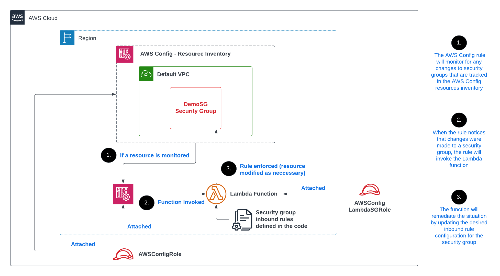

 

  <h1 align="center">Automating Incident Remediation with AWS Config and Lambda</h1>
  

     
   Detailed Instructions found on my: [Blog](https://blog.digitalden.cloud/automating-incident-remediation-with-aws-config-and-lambda-9efc077b72e9)
     
   
  

### Project date
------------------
16.05-2023

### Tech Stack
------------------
- AWS Identity and Access Management (IAM)
- AWS Config
- AWS Lambda
- AWS CloudWatch

### Project Description
-----------------
Monitored Amazon EC2 security group settings in my AWS account. Defined which inbound ports should and shouldn't be open in a security group. Configured a solution to automatically remediate an incident where someone modified a security group's inbound rules and they no longer conform with the desired configuration.

Used the AWS Config service to monitor changes to specific resources in my AWS account. Used the service to identify changes that could be a security concern, such as a user modifying an Amazon EC2 security group. Integrated AWS Config with AWS Lambda to automatically remediate specific security incidents of concern.

### Objectives
-----------------
- [x] Create IAM roles to grant AWS services access to other AWS services.
- [x] Enable AWS Config to monitor resources in my AWS account.
- [x] Create a Lambda function and import function code.
- [x] Create and enable a custom AWS Config rule that uses my Lambda function.
- [x] Test the behaviour of an AWS Config rule to ensure it works as intended.
- [x] Analyse Amazon CloudWatch logs to audit when AWS Config rules are invoked.
