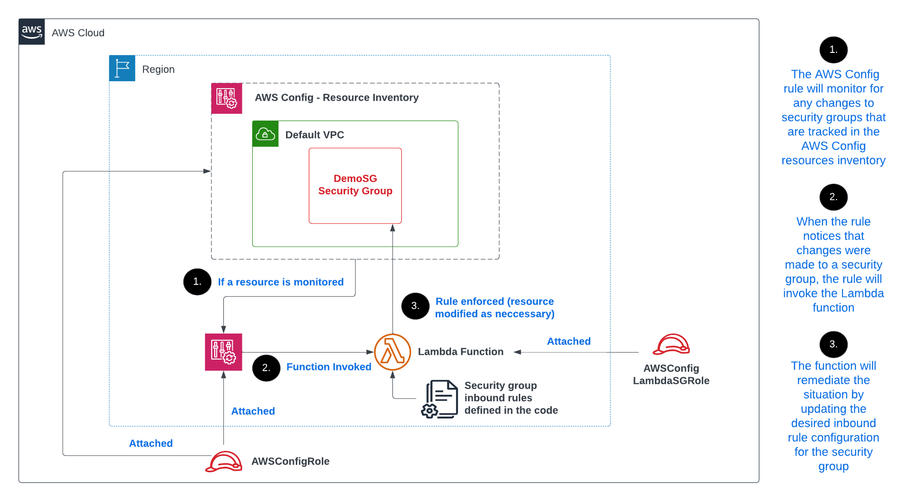

 

  
  <h1 align="center">Automating Incident Remediation with AWS Config and Lambda</h1>
  

    "Strengthening AWS Resource Security: Using AWS Config and Lambda for Proactive Monitoring and Automated Remediation of Security Concerns."
  

